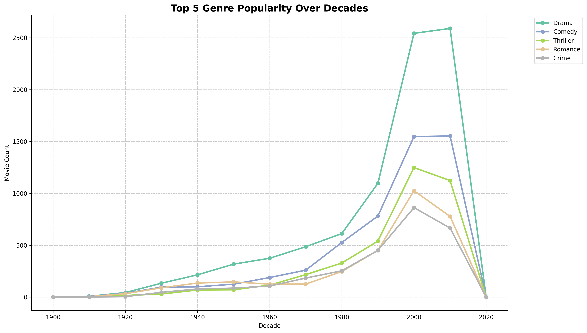

# 🎬 Movie Knowledge Graph: Semantic DataOps Pipeline


## 📖 The Project

This project implements an end-to-end **DataOps pipeline** that transforms unstructured and semi-structured movie data into a rich **Semantic Knowledge Graph**. 

By leveraging the **Lambda Architecture**, this system ingests raw data from disparate sources (IMDb, TMDb, MovieTweetings), enforces strict data quality checks, and models the relationships between movies, crews, and user ratings using RDF/SPARQL standards. The final result is a queryable graph database used to uncover industry trends, such as gender representation in cinema and genre evolution over decades.

## 🏗️ Architecture

The system is containerized using Docker and orchestrated by Apache Airflow. It follows a multi-stage lakehouse approach:

<p align="center">
  
</p>

### Pipeline Stages
1.  **Ingestion:** Automated retrieval of datasets (CSVs, APIs) into HDFS. Handles incremental loading via hash comparison.
2.  **Refinement:** PySpark jobs standardize schemas, handle encoding, and format data into Parquet.
3.  **Quality Assurance:** Rigorous data profiling and constraint checking (e.g., "Birth year cannot be in the future") to ensure integrity.
4.  **Semantic Modeling:** Transformation of relational data into RDF triples (Turtle format) and loading into Ontotext GraphDB.
5.  **Analytics:** Extraction of insights using SPARQL queries and Python for visualization.

## 🛠️ Tech Stack

*   **Orchestration:** Apache Airflow
*   **Processing:** Apache Spark (PySpark), Pandas
*   **Storage:** HDFS (Hadoop Distributed File System)
*   **Semantic DB:** Ontotext GraphDB (SPARQL endpoint)
*   **Containerization:** Docker & Docker Compose
*   **Analysis:** PyKEEN (Knowledge Graph Embeddings), Matplotlib

## 🚀 Getting Started

### Prerequisites
*   Docker & Docker Compose installed
*   4GB+ RAM available for containers

### Installation
1.  Clone the repository:
    ```bash
    git clone https://github.com/yourusername/movie-knowledge-graph.git
    cd movie-knowledge-graph
    ```

2.  Start the infrastructure:
    ```bash
    docker-compose -f infrastructure/docker-compose.yaml up -d
    ```

3.  Access the services:
    *   **Airflow UI:** [http://localhost:8080](http://localhost:8080) (User/Pass: `admin`/`admin`)
    *   **GraphDB:** [http://localhost:7200](http://localhost:7200)

4.  Trigger the `Movie_KG_Pipeline` DAG in Airflow to start the ingestion.

## 📊 Sample Insights

**Genre Evolution Over Time**
*How have movie genres shifted popularity over the last century?*
